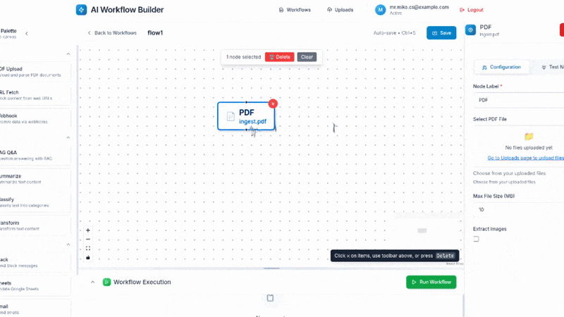

# AI Workflow Builder

A professional no-code AI workflow automation platform that allows users to create, edit, and execute complex workflows through an intuitive visual interface.

## 🎬 Platform Demo



*See how easy it is to build AI workflows with drag-and-drop simplicity*

## Features

- **Visual Workflow Editor**: Drag-and-drop interface for building workflows
- **Node-based Architecture**: PDF processing, AI summarization, text transformation, and more
- **Real-time Execution**: Run workflows with live progress tracking and logs
- **Professional UI**: Modern, responsive design with collapsible panels and draggable components
- **AI Integration**: OpenAI-powered summarization with configurable types and lengths
- **File Management**: PDF upload and processing capabilities

## Quick Start

1. **Start the application**:
   ```bash
   docker-compose up -d
   ```

2. **Access the platform**:
   - Frontend: http://localhost:3000
   - Backend API: http://localhost:8000

3. **Create your first workflow**:
   - Navigate to "Workflows"
   - Click "Create New Workflow"
   - Drag nodes from the palette to the canvas
   - Connect nodes and configure settings
   - Run your workflow

## Architecture

- **Frontend**: Next.js + React + TypeScript + Tailwind CSS
- **Backend**: FastAPI + Python
- **Database**: MongoDB
- **Message Queue**: Redis + Dramatiq
- **Vector Database**: Qdrant
- **Containerization**: Docker + Docker Compose

## Environment Setup

Create a `.env` file in the root directory:
```env
OPENAI_API_KEY=your_openai_api_key_here
MONGODB_URL=mongodb://mongodb:27017/workflow_db
REDIS_URL=redis://redis:6379
```

## Development

- **Backend**: `backend/apps/api/` - FastAPI application
- **Worker**: `backend/apps/worker/` - Background task processing
- **Frontend**: `frontend/apps/web/` - Next.js application

## Node Types

- **PDF**: Extract text from uploaded PDF files
- **AI Summarize**: Generate summaries using OpenAI (brief, detailed, bullet points)
- **Text Transform**: Process and transform text content
- **Output**: Display and export results

## License

Private project - All rights reserved. 